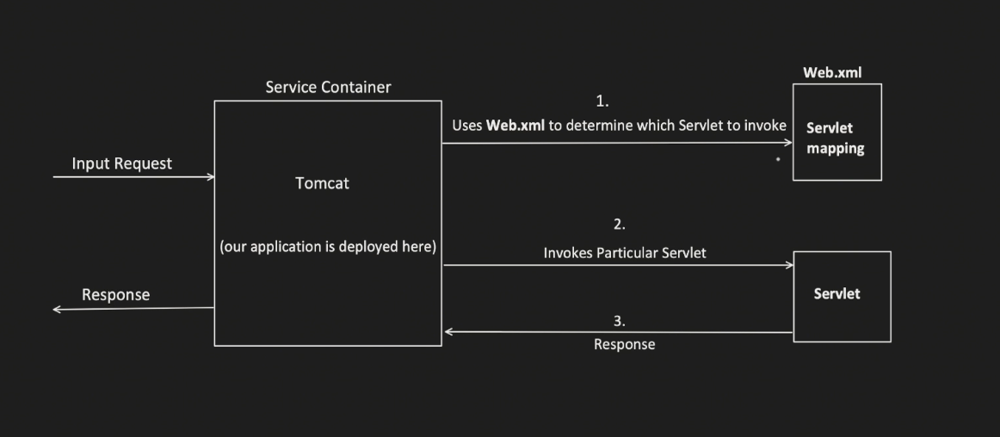

## Introduction :tada: :rocket:
Before we have intro to spring boot , we must understand why it was developed in the first place and what challenges it solves unlike traditional methods like `Servelets`


### Servlet
A servlet is a java class that handles the client request, 
process it and return the response , 
and the container which manages the servlet are called Servlet containers,
Tomcat is also known as servlet containers.



Even before **SpringBoot** comes into picture , **Spring framework** , solves challenges which exists with Servlets like,
- Removal of `web.xml`
  - This web.xml over the time becomes too big and becomes very difficult to manage and understand.
  - Spring framework introduced, annotation based configuration
- Inversion of control ( IOC )
  - Servlets depends on Servlet container to create object and maintain its lifecycle
  - IoC is more flexible way to manage object dependencies and its lifecycle ( through dependency injection)
- Unit testing is much harder
  - As the object creation depends on the servlets, mocking is not easy , which makes unit testing process harder.
  - Spring dependency injection facility makes the unit testing very easy.
- Difficult to manage REST api's
  - Handling different HTTP methods , request parameters, path mapping make code little difficult to understand.
  - Spring MVC provides an organised approach to handle the request and its easy to build.

### Problems spring boot solves?
- Dependency Management
  - No need for adding different dependencies seperately and also the compatible version headache.
- Auto configuration
  - No need for seperately configuring "DispatchServlet", "AppConfig", "EnableWebMvc","ComponentScan", spring boot add internally by-default
  - ```java
    @SpringBootApplication
    public class SpringBootApplication {
        public static void main(String[] args){
          SpringBootApplication.run(SpringBootApplication.class, args);
        }
    }
    ```
- Embedded Server
  - In traditional SpringMVC application, we need to build a WAR file, which is a packaged file containing your application's classes, JSP pages, configuration files and dependencies.
  - Then we need to deploy this WAR file to a servlet container like tom cat
  - But in springboot , servlet container is already embedded , we dont have do all this stuff, just run the application and thats all.


